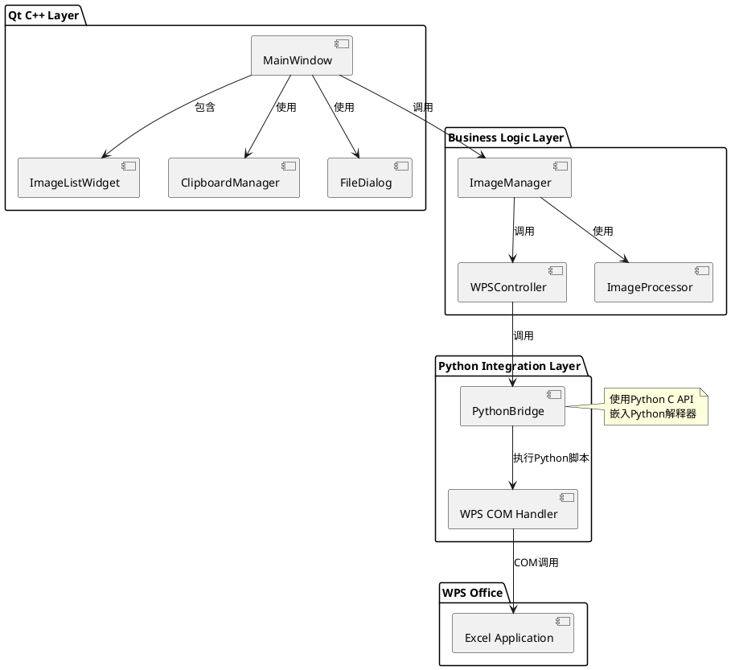
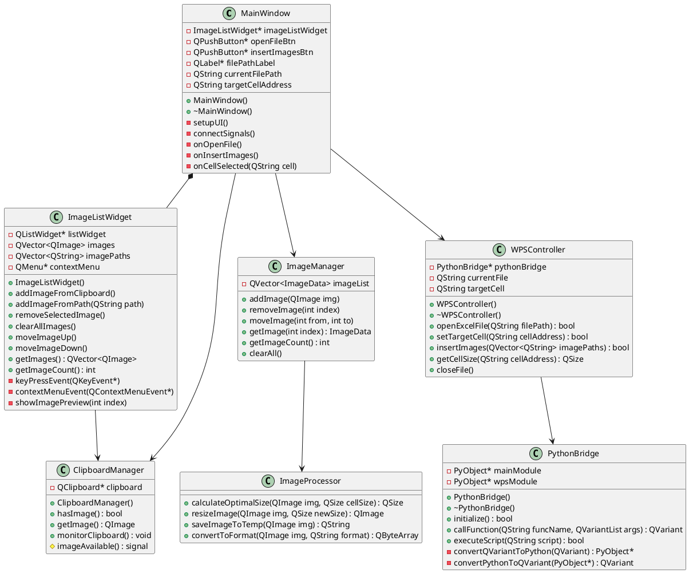
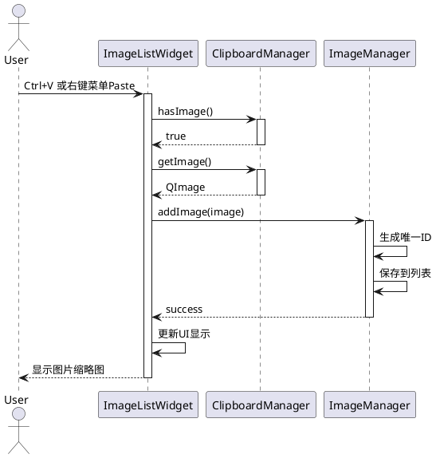
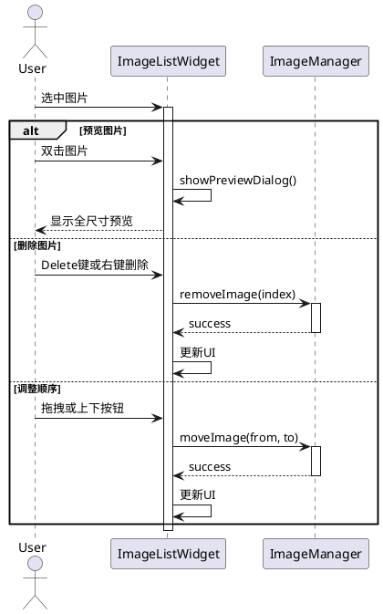
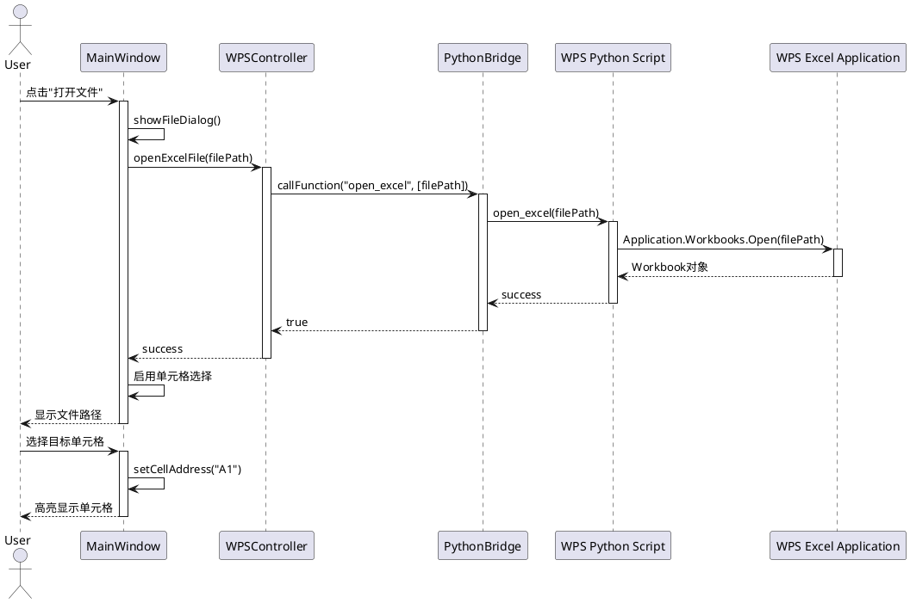
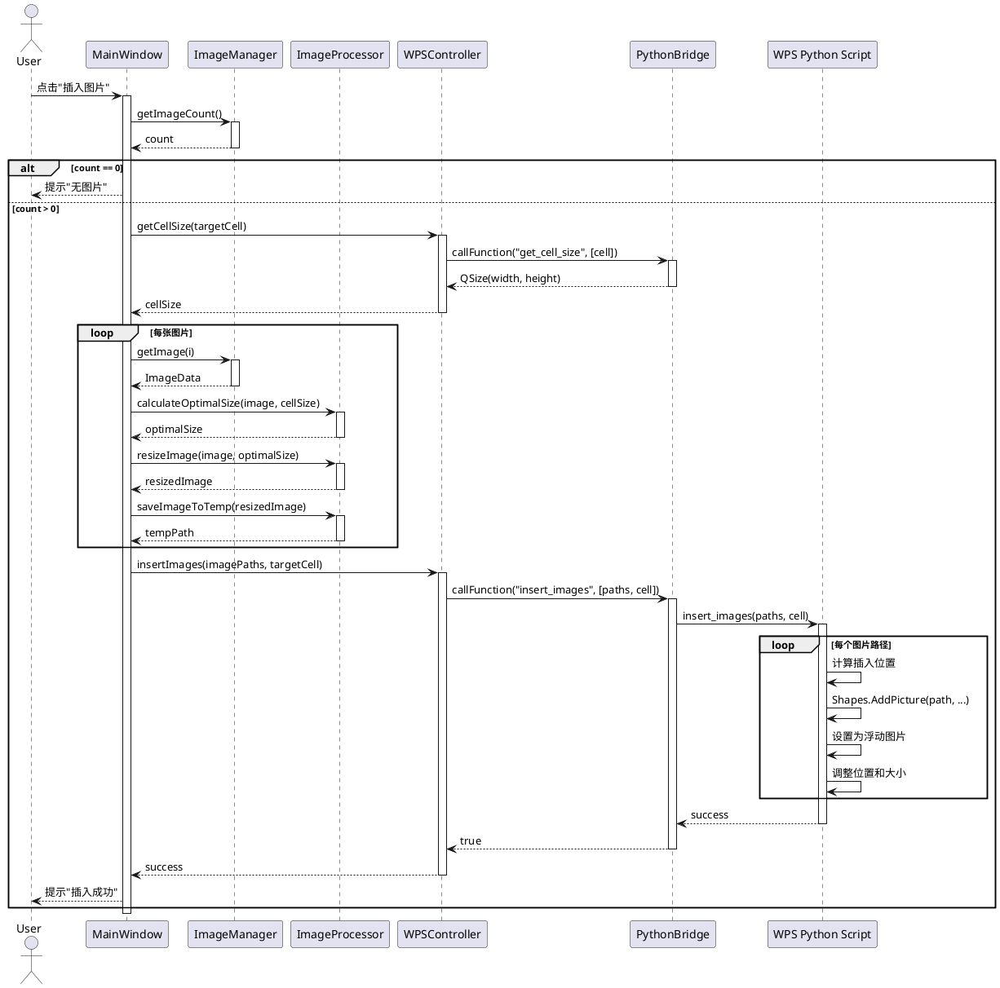
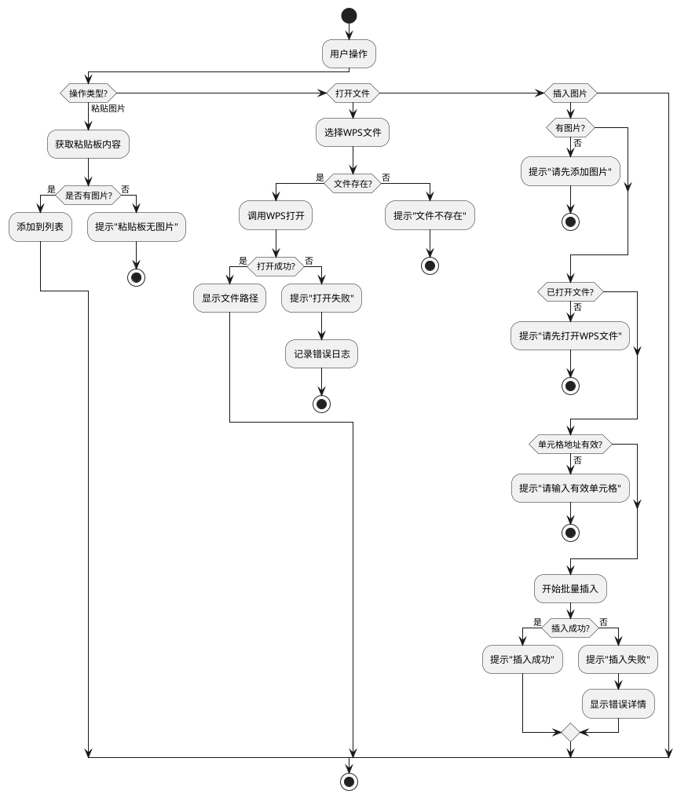

# WPS图片批量嵌入工具 - 软件设计方案报告

## 1. 项目概述

### 1.1 项目背景
本项目旨在开发一个基于Qt5.12和C++/Python的桌面应用工具，用于将系统粘贴板中的截图或图片以浮动图片的方式批量嵌入到WPS Excel文件的指定单元格中。

### 1.2 技术栈
- **GUI框架**: Qt 5.12
- **编程语言**: C++（核心功能）、Python（WPS操作）
- **构建系统**: CMake
- **第三方库**: 
  - Qt5 (Widgets, Core, Gui)
  - Python C API (用于C++与Python交互)
  - WPS Office COM API / Python win32com (Windows平台)

### 1.3 目标平台
- Windows (优先支持，因为WPS COM API在Windows上支持最完善)
- 可扩展至Linux/macOS（使用WPS Linux API或替代方案）

## 2. 系统架构设计

### 2.1 整体架构



### 2.2 模块划分

#### 2.2.1 UI模块（Qt C++）
- **MainWindow**: 主窗口，负责整体界面布局
- **ImageListWidget**: 图片交互框，显示和管理图片列表
- **ClipboardManager**: 监听和处理系统粘贴板事件
- **FileDialogHandler**: WPS文件选择对话框

#### 2.2.2 业务逻辑模块（C++）
- **ImageManager**: 管理图片数据（添加、删除、排序、预览）
- **ImageProcessor**: 图片处理（缩放、格式转换、尺寸计算）
- **WPSController**: WPS操作控制器，协调Python桥接

#### 2.2.3 Python集成模块
- **PythonBridge**: C++与Python交互的桥梁
- **WPSComHandler**: Python脚本，使用COM API操作WPS Excel

## 3. 详细设计

### 3.1 类设计



### 3.2 数据结构设计

```cpp
// 图片数据结构
struct ImageData {
    QImage image;           // 原始图片
    QString tempPath;       // 临时文件路径
    QDateTime addTime;      // 添加时间
    QSize originalSize;     // 原始尺寸
    QString format;         // 图片格式
};

// WPS单元格信息
struct CellInfo {
    QString address;        // 单元格地址（如"A1"）
    QPoint position;        // 像素位置
    QSize size;            // 单元格尺寸（像素）
    int row;               // 行号
    int column;            // 列号
};

// 插入配置
struct InsertConfig {
    QString cellAddress;    // 目标单元格
    int maxWidth;          // 最大宽度（像素）
    int maxHeight;         // 最大高度（像素）
    int spacing;           // 图片间距
    bool maintainRatio;    // 保持宽高比
    QString layout;        // 布局方式："vertical" 或 "grid"
};
```

## 4. 功能流程设计

### 4.1 图片粘贴流程



### 4.2 图片管理流程



### 4.3 WPS文件操作流程



### 4.4 图片插入流程



## 5. Python WPS操作模块设计

### 5.1 Python脚本结构

```python
# wps_handler.py

import win32com.client
import pythoncom
import os
from typing import List, Tuple, Dict

class WPSExcelHandler:
    """WPS Excel操作处理器"""
    
    def __init__(self):
        self.app = None
        self.workbook = None
        self.worksheet = None
        
    def open_excel(self, file_path: str) -> bool:
        """打开Excel文件"""
        try:
            pythoncom.CoInitialize()
            self.app = win32com.client.Dispatch("Ket.Application")
            self.app.Visible = True
            self.workbook = self.app.Workbooks.Open(file_path)
            self.worksheet = self.workbook.ActiveSheet
            return True
        except Exception as e:
            print(f"Error: {e}")
            return False
    
    def get_cell_info(self, cell_address: str) -> Dict:
        """获取单元格信息"""
        try:
            cell = self.worksheet.Range(cell_address)
            return {
                'left': cell.Left,
                'top': cell.Top,
                'width': cell.Width,
                'height': cell.Height,
                'row': cell.Row,
                'column': cell.Column
            }
        except Exception as e:
            print(f"Error: {e}")
            return None
    
    def insert_floating_image(self, image_path: str, cell_address: str, 
                            offset_x: int = 0, offset_y: int = 0,
                            width: int = None, height: int = None) -> bool:
        """在指定单元格插入浮动图片"""
        try:
            cell_info = self.get_cell_info(cell_address)
            if not cell_info:
                return False
            
            # 计算插入位置
            left = cell_info['left'] + offset_x
            top = cell_info['top'] + offset_y
            
            # 插入图片
            shape = self.worksheet.Shapes.AddPicture(
                Filename=image_path,
                LinkToFile=False,
                SaveWithDocument=True,
                Left=left,
                Top=top,
                Width=-1,  # 保持原始宽高比
                Height=-1
            )
            
            # 如果指定了尺寸，调整大小
            if width and height:
                shape.Width = width
                shape.Height = height
            
            # 设置为浮动图片（不随单元格移动）
            shape.Placement = 3  # xlFreeFloating
            
            return True
        except Exception as e:
            print(f"Error: {e}")
            return False
    
    def insert_images_batch(self, image_paths: List[str], 
                           start_cell: str,
                           layout: str = "vertical",
                           spacing: int = 5) -> bool:
        """批量插入图片"""
        try:
            cell_info = self.get_cell_info(start_cell)
            if not cell_info:
                return False
            
            current_offset_y = 0
            current_offset_x = 0
            
            for i, image_path in enumerate(image_paths):
                if layout == "vertical":
                    # 垂直排列
                    self.insert_floating_image(
                        image_path, 
                        start_cell,
                        offset_x=0,
                        offset_y=current_offset_y
                    )
                    # 获取插入图片的高度，计算下一个偏移
                    last_shape = self.worksheet.Shapes(self.worksheet.Shapes.Count)
                    current_offset_y += last_shape.Height + spacing
                    
                elif layout == "grid":
                    # 网格排列（待实现）
                    pass
            
            return True
        except Exception as e:
            print(f"Error: {e}")
            return False
    
    def save_and_close(self):
        """保存并关闭文件"""
        try:
            if self.workbook:
                self.workbook.Save()
                self.workbook.Close()
            if self.app:
                self.app.Quit()
            pythoncom.CoUninitialize()
        except Exception as e:
            print(f"Error: {e}")
```

### 5.2 C++ Python桥接实现

```cpp
// python_bridge.h
class PythonBridge {
private:
    PyObject* pModule;
    PyObject* pHandlerClass;
    PyObject* pHandlerInstance;
    
public:
    PythonBridge();
    ~PythonBridge();
    
    bool initialize();
    bool openExcel(const QString& filePath);
    QVariantMap getCellInfo(const QString& cellAddress);
    bool insertImage(const QString& imagePath, 
                    const QString& cellAddress,
                    int offsetX, int offsetY,
                    int width, int height);
    bool insertImagesBatch(const QStringList& imagePaths,
                          const QString& startCell,
                          const QString& layout,
                          int spacing);
    void saveAndClose();
    
private:
    PyObject* toPyString(const QString& str);
    QString fromPyString(PyObject* obj);
    PyObject* toPyList(const QStringList& list);
};
```

## 6. CMake项目结构

```cmake
# CMakeLists.txt (根目录)

cmake_minimum_required(VERSION 3.10)
project(WPSImageTool VERSION 1.0.0 LANGUAGES CXX)

set(CMAKE_CXX_STANDARD 11)
set(CMAKE_CXX_STANDARD_REQUIRED ON)

# Qt5配置
set(CMAKE_AUTOMOC ON)
set(CMAKE_AUTORCC ON)
set(CMAKE_AUTOUIC ON)
find_package(Qt5 COMPONENTS Core Widgets Gui REQUIRED)

# Python配置
find_package(Python3 COMPONENTS Interpreter Development REQUIRED)

# 包含目录
include_directories(
    ${CMAKE_SOURCE_DIR}/include
    ${Python3_INCLUDE_DIRS}
)

# 源文件
set(SOURCES
    src/main.cpp
    src/mainwindow.cpp
    src/imagelistwidget.cpp
    src/clipboardmanager.cpp
    src/imagemanager.cpp
    src/imageprocessor.cpp
    src/wpscontroller.cpp
    src/pythonbridge.cpp
)

set(HEADERS
    include/mainwindow.h
    include/imagelistwidget.h
    include/clipboardmanager.h
    include/imagemanager.h
    include/imageprocessor.h
    include/wpscontroller.h
    include/pythonbridge.h
)

# 资源文件
set(RESOURCES
    resources/resources.qrc
)

# 创建可执行文件
add_executable(${PROJECT_NAME} ${SOURCES} ${HEADERS} ${RESOURCES})

# 链接库
target_link_libraries(${PROJECT_NAME}
    Qt5::Core
    Qt5::Widgets
    Qt5::Gui
    ${Python3_LIBRARIES}
)

# 复制Python脚本到输出目录
add_custom_command(TARGET ${PROJECT_NAME} POST_BUILD
    COMMAND ${CMAKE_COMMAND} -E copy_directory
    ${CMAKE_SOURCE_DIR}/python_scripts
    $<TARGET_FILE_DIR:${PROJECT_NAME}>/python_scripts
)

# 安装
install(TARGETS ${PROJECT_NAME} DESTINATION bin)
install(DIRECTORY python_scripts DESTINATION bin)
```

### 6.1 项目目录结构

```
WPSImageTool/
├── CMakeLists.txt
├── README.md
├── include/
│   ├── mainwindow.h
│   ├── imagelistwidget.h
│   ├── clipboardmanager.h
│   ├── imagemanager.h
│   ├── imageprocessor.h
│   ├── wpscontroller.h
│   └── pythonbridge.h
├── src/
│   ├── main.cpp
│   ├── mainwindow.cpp
│   ├── imagelistwidget.cpp
│   ├── clipboardmanager.cpp
│   ├── imagemanager.cpp
│   ├── imageprocessor.cpp
│   ├── wpscontroller.cpp
│   └── pythonbridge.cpp
├── python_scripts/
│   ├── wps_handler.py
│   └── __init__.py
├── resources/
│   ├── resources.qrc
│   ├── icons/
│   │   ├── paste.png
│   │   ├── delete.png
│   │   ├── open.png
│   │   └── insert.png
│   └── ui/
│       └── mainwindow.ui (可选)
└── tests/
    └── test_main.cpp
```

## 7. UI设计

### 7.1 主界面布局

```
┌─────────────────────────────────────────────────────┐
│  WPS 图片批量嵌入工具                        [_][□][×] │
├─────────────────────────────────────────────────────┤
│  文件: [                                    ] [打开] │
│  单元格: [A1                               ] [选择] │
├─────────────────────────────────────────────────────┤
│  图片列表                                     │      │
│  ┌──────────────────────────────────────┐   │      │
│  │  [缩略图1]  image1.png         [预览] │   │ [↑]  │
│  │  [缩略图2]  image2.png         [预览] │   │ [↓]  │
│  │  [缩略图3]  image3.png         [预览] │   │ [Del]│
│  │                                        │   │      │
│  │  右键菜单:                              │   │      │
│  │  - Paste (Ctrl+V)                     │   │      │
│  │  - Delete                             │   │      │
│  │  - Preview                            │   │      │
│  │  - Move Up/Down                       │   │      │
│  │  - Clear All                          │   │      │
│  └──────────────────────────────────────┘   │      │
├─────────────────────────────────────────────────────┤
│  [清空列表]              [插入到WPS]          │      │
└─────────────────────────────────────────────────────┘
```

### 7.2 UI交互说明

1. **文件选择区**：
   - 文本框显示当前打开的WPS文件路径
   - "打开"按钮弹出文件选择对话框

2. **单元格选择区**：
   - 文本框输入目标单元格地址（如"A1"）
   - "选择"按钮可在WPS中高亮选择单元格（可选功能）

3. **图片列表区**：
   - 显示所有已添加的图片缩略图
   - 支持Ctrl+V粘贴图片
   - 右键菜单提供操作选项
   - 侧边按钮快速调整顺序和删除

4. **操作按钮区**：
   - "清空列表"：删除所有图片
   - "插入到WPS"：执行批量插入操作

## 8. 关键技术点

### 8.1 系统粘贴板监听

使用Qt的`QClipboard`类监听粘贴板变化：

```cpp
void ClipboardManager::monitorClipboard() {
    connect(clipboard, &QClipboard::dataChanged, 
            this, &ClipboardManager::onClipboardChanged);
}

void ClipboardManager::onClipboardChanged() {
    if (clipboard->mimeData()->hasImage()) {
        emit imageAvailable();
    }
}
```

### 8.2 图片尺寸自动计算

根据单元格大小和图片原始尺寸，保持宽高比计算最优尺寸：

```cpp
QSize ImageProcessor::calculateOptimalSize(const QImage& image, 
                                          const QSize& cellSize) {
    QSize imageSize = image.size();
    QSize targetSize = cellSize;
    
    // 保持宽高比
    if (imageSize.width() > targetSize.width() || 
        imageSize.height() > targetSize.height()) {
        imageSize.scale(targetSize, Qt::KeepAspectRatio);
    }
    
    return imageSize;
}
```

### 8.3 Python C API集成

```cpp
bool PythonBridge::initialize() {
    Py_Initialize();
    
    // 添加Python脚本路径
    PyRun_SimpleString("import sys");
    PyRun_SimpleString("sys.path.append('./python_scripts')");
    
    // 导入模块
    PyObject* pName = PyUnicode_DecodeFSDefault("wps_handler");
    pModule = PyImport_Import(pName);
    Py_DECREF(pName);
    
    if (!pModule) {
        PyErr_Print();
        return false;
    }
    
    // 获取类
    pHandlerClass = PyObject_GetAttrString(pModule, "WPSExcelHandler");
    if (!pHandlerClass || !PyCallable_Check(pHandlerClass)) {
        return false;
    }
    
    // 创建实例
    pHandlerInstance = PyObject_CallObject(pHandlerClass, nullptr);
    return pHandlerInstance != nullptr;
}
```

### 8.4 WPS COM API使用

WPS Excel的COM接口与Microsoft Office类似，主要使用：

- `Application`: WPS应用程序对象
- `Workbooks`: 工作簿集合
- `Worksheet`: 工作表对象
- `Range`: 单元格范围对象
- `Shapes.AddPicture()`: 插入图片方法

## 9. 错误处理机制

### 9.1 异常处理策略



### 9.2 日志记录

使用Qt的日志系统记录关键操作和错误：

```cpp
void setupLogging() {
    qInstallMessageHandler([](QtMsgType type, 
                              const QMessageLogContext& context,
                              const QString& msg) {
        QString logFile = "wps_image_tool.log";
        QFile file(logFile);
        if (file.open(QIODevice::WriteOnly | QIODevice::Append)) {
            QTextStream stream(&file);
            stream << QDateTime::currentDateTime().toString("yyyy-MM-dd hh:mm:ss ");
            stream << msg << "\n";
        }
    });
}
```

## 10. 性能优化

### 10.1 图片处理优化

1. **异步加载**：使用`QThread`在后台线程处理图片
2. **缩略图缓存**：生成缩略图并缓存，避免重复计算
3. **延迟加载**：大量图片时采用虚拟列表，按需加载

### 10.2 内存管理

1. **智能指针**：使用`QSharedPointer`管理图片数据
2. **临时文件清理**：插入完成后自动删除临时文件
3. **图片格式转换**：使用压缩格式减少内存占用

## 11. 扩展性设计

### 11.1 插件化架构（未来扩展）

支持不同Office软件的插件：

```cpp
class IOfficePlugin {
public:
    virtual bool openFile(const QString& path) = 0;
    virtual bool insertImage(const QString& imagePath, 
                            const QString& cellAddress) = 0;
    virtual QSize getCellSize(const QString& cellAddress) = 0;
    virtual ~IOfficePlugin() = default;
};

class WPSPlugin : public IOfficePlugin { ... };
class ExcelPlugin : public IOfficePlugin { ... };
class LibreOfficePlugin : public IOfficePlugin { ... };
```

### 11.2 配置文件支持

使用JSON或INI文件保存用户配置：

```json
{
  "defaultLayout": "vertical",
  "imageSpacing": 5,
  "maxImageWidth": 800,
  "maxImageHeight": 600,
  "autoSave": true,
  "tempDirectory": "./temp",
  "shortcuts": {
    "paste": "Ctrl+V",
    "delete": "Delete",
    "preview": "Space"
  }
}
```

## 12. 测试计划

### 12.1 单元测试

- `ImageManager`图片管理功能测试
- `ImageProcessor`图片处理算法测试
- `PythonBridge` Python交互测试

### 12.2 集成测试

- 完整的粘贴-插入流程测试
- WPS文件操作测试
- 多图片批量插入测试

### 12.3 UI测试

- 快捷键功能测试
- 右键菜单测试
- 拖拽排序测试

## 13. 部署方案

### 13.1 依赖打包

使用`windeployqt`（Windows）打包Qt依赖：

```bash
windeployqt.exe --release --no-translations WPSImageTool.exe
```

### 13.2 Python环境

两种方案：
1. **嵌入式Python**：使用Python Embedded版本，与程序一起分发
2. **系统Python**：要求用户安装Python和依赖包

推荐使用嵌入式Python方案，提供更好的用户体验。

### 13.3 安装包制作

使用NSIS或Inno Setup创建安装程序：

```
WPSImageTool-Setup.exe
├── WPSImageTool.exe
├── Qt5Core.dll
├── Qt5Widgets.dll
├── Qt5Gui.dll
├── python39.dll
├── python_scripts/
│   └── wps_handler.py
└── python39/
    └── Lib/
        └── site-packages/
            └── pywin32/
```

## 14. 开发计划

### 14.1 里程碑

**阶段1：基础框架（2周）**
- CMake项目搭建
- Qt主界面开发
- 图片列表功能实现

**阶段2：核心功能（3周）**
- 粘贴板管理
- Python桥接实现
- WPS操作脚本开发

**阶段3：集成与优化（2周）**
- 功能集成测试
- 性能优化
- 错误处理完善

**阶段4：测试与发布（1周）**
- 完整测试
- 文档编写
- 打包发布

### 14.2 技术风险与应对

| 风险 | 影响 | 概率 | 应对措施 |
|------|------|------|----------|
| WPS COM API文档不足 | 高 | 中 | 参考VBA文档，通过实验验证 |
| Python集成稳定性问题 | 中 | 低 | 充分测试，添加异常处理 |
| 跨平台兼容性 | 中 | 高 | 优先Windows，后续扩展其他平台 |
| 图片处理性能 | 低 | 低 | 使用多线程和缓存机制 |

## 15. 总结

本设计方案提供了一个完整的基于Qt5.12和C++/Python的WPS图片批量嵌入工具的实现方案。主要特点包括：

1. **清晰的架构设计**：分层架构，模块职责明确
2. **良好的用户体验**：直观的UI，便捷的快捷键操作
3. **可扩展性**：插件化设计，易于支持其他Office软件
4. **完善的错误处理**：多层次的异常捕获和用户提示
5. **跨语言集成**：C++与Python无缝集成，充分利用各自优势

通过CMake构建系统，项目具有良好的可维护性和可移植性。后续可根据实际需求进行功能扩展和优化。
